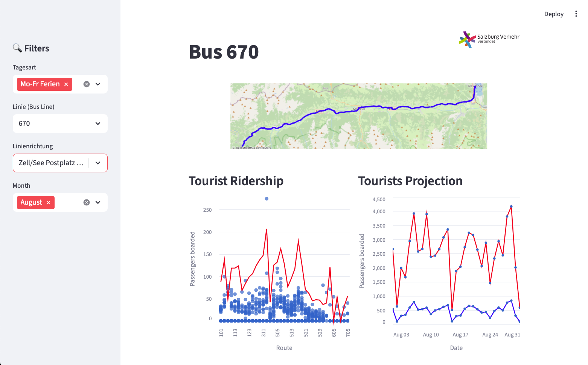

# Salzburger Guest Mobility Ticket -- Tourism Technology Festival 3.0

## Challenge Overview

The **Salzburger Verkehrsverbund (SVV)** provides the **Salzburg Guest Mobility Ticket** for tourists, which allows them to travel throughout the province of Salzburg as part of their paid tourism fee/incoming tax.

Aside from being a convenient travel service, the ticket also supports the registration process for incoming tourists. Guests check in to public transport by scanning their ticket, using specially installed hardware.

### Challenge Points

1. **Low Scanning Rates:** Even though guests should scan their tickets, only 10–30% do so due to:

   * Lack of awareness about the scanning process.
   * Inconvenience, e.g., when entering with skiing gear.
2. **Data Utilization:** Use the provided dataset to extract insights and identify gaps in information.
3. **Better Tracking:** Explore ways for SVV to track tourist activity in public transport to measure the impact of the Salzburg Guest Mobility Ticket.


## Our Solution


We built an **interactive dashboard** with **Streamlit** to:

* Analyze the dataset provided by SVV.
* Predict passenger boarding counts on specific routes.
* Help SVV staff make informed decisions about **route demand** at specific dates and times.

### Features

* **Passenger Analytics:** View daily and route-wise passenger boarding trends.
* **Prediction:** Estimate boarding counts for better resource planning.
* **Route Visualization:**
  * OpenStreetMap (OSM) to display bus routes.
  * GTFS data for accurate bus stop locations.
  * Statistics Austria for **Gemeinde** information and tourism statistics.


## Tech Stack

* Python
* Streamlit
* Pandas, NumPy, Altair for data analysis and visualization
* OpenStreetMap & GTFS for spatial visualization


## Setup Instructions

1. **Create a virtual environment and activate it**:

   ```bash
   python -m venv .venv
   .venv\Scripts\activate     # On Windows
   source .venv/bin/activate  # On macOS/Linux
   ```

2. **Install dependencies**:

   ```bash
   pip install -r requirements.txt
   ```

3. **Run the dashboard**:

   ```bash
   streamlit run app.py
   ```


## 📄 License

This project's source code is licensed under the **MIT License**.

<details>
<summary>View Full License Text</summary>

```
MIT License

Copyright (c) 2025 Hubert Setiawan

Permission is hereby granted, free of charge, to any person obtaining a copy
of this software and associated documentation files (the "Software"), to deal
in the Software without restriction, including without limitation the rights
to use, copy, modify, merge, publish, distribute, sublicense, and/or sell
copies of the Software, and to permit persons to whom the Software is
furnished to do so, subject to the following conditions:

The above copyright notice and this permission notice shall be included in
all copies or substantial portions of the Software.

THE SOFTWARE IS PROVIDED "AS IS", WITHOUT WARRANTY OF ANY KIND, EXPRESS OR
IMPLIED, INCLUDING BUT NOT LIMITED TO THE WARRANTIES OF MERCHANTABILITY,
FITNESS FOR A PARTICULAR PURPOSE AND NONINFRINGEMENT. IN NO EVENT SHALL THE
AUTHORS OR COPYRIGHT HOLDERS BE LIABLE FOR ANY CLAIM, DAMAGES OR OTHER
LIABILITY, WHETHER IN AN ACTION OF CONTRACT, TORT OR OTHERWISE, ARISING FROM,
OUT OF OR IN CONNECTION WITH THE SOFTWARE OR THE USE OR OTHER DEALINGS IN
THE SOFTWARE.
```
</details>

### 🗺️ OpenStreetMap Data

Map and geographic data are sourced from [OpenStreetMap](https://www.openstreetmap.org), available under the [Open Database License (ODbL)](https://opendatacommons.org/licenses/odbl/).

**Attribution:** © [OpenStreetMap contributors](https://www.openstreetmap.org/copyright)

---

## 🤝 Contributing

Contributions are welcome! We appreciate your help in making this project better.

### How You Can Help

- 🚌 **Add support for more bus routes**
- 🎨 **Improve visualization features** (map styles, terrain/satellite views, animations)
- 📊 **Enhance data coverage** (schedules, pricing, accessibility info)
- 🌐 **Build an interactive or web-based version**
- ⏱️ **Integrate real-time schedule or elevation data**
- 🐛 **Report bugs or suggest improvements**
- 📝 **Improve documentation**

### Contribution Workflow

1. **Fork the repository**
2. **Create a new branch** (`git checkout -b feature/my-improvement`)
3. **Make your changes** and commit them (`git commit -m 'Add amazing feature'`)
4. **Push to your branch** (`git push origin feature/my-improvement`)
5. **Open a Pull Request**

### Code Style

- Follow PEP 8 style guide
- Add docstrings to functions
- Include comments for complex logic
- Keep functions focused and small

---

## 🙏 Acknowledgments

We would like to thank the following projects and organizations:

- **[OpenStreetMap](https://www.openstreetmap.org)** — Open, community-driven geographic data
- **[Overpass API](https://overpass-api.de/)** — For OSM data access
- **[Matplotlib](https://matplotlib.org/)** — Visualization library
- **[Streamlit](https://streamlit.io/)** — For easy web app development
- **[Salzburger Verkehrsverbund](https://salzburg-verkehr.at/)** — For maintaining the real-world bus routes and providing data

---

## 🔗 Related Projects

- [OpenStreetMap](https://www.openstreetmap.org) — Free, editable map of the world
- [Overpass API](https://overpass-api.de/) — Read-only API for OpenStreetMap data
- [Salzburg Public Transport](https://salzburg-verkehr.at/) — Official transport authority website
- [Streamlit](https://streamlit.io/) — The fastest way to build and share data apps